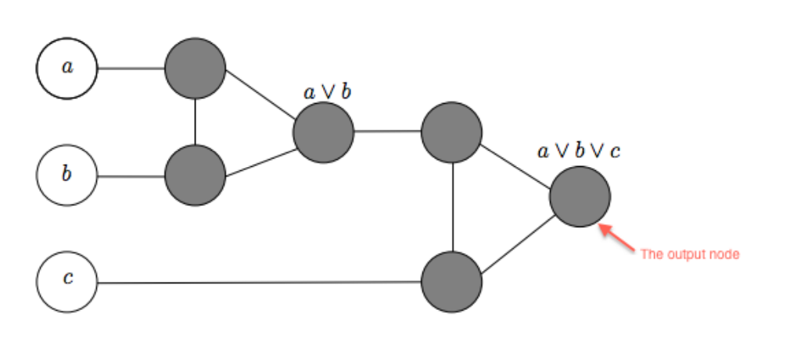
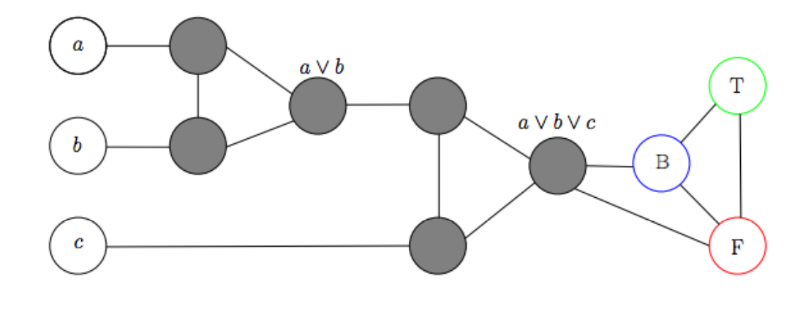

### Clique

>Un clique es un subgrafo completo dentro de un grafo. Formalmente, un clique en un grafo $G=(V,E)$ es un subconjunto de vértices $C \subseteq V$, tal que todos los pares de vértices en $C$ están conectados directamente por una arista. En otras palabras, todos los vértices del clique están mutuamente conectados.
>
>Hallar el clique de mayor tamaño en un grafo.

Vamos a demostrar que Clique (maximal) es un problema NP-Hard. Para esto vamos a coger el problema SAT que sabemos que es NP-Completo y reducirlo a  Clique (maximal).

> SAT $\leq_p$ Clique (maximal)

Dado un conjunto $F=\set{C_1,\dots,C_l}$ de $l$ cláusulas construidas a partir de $n$ variables booleanas tenemos que contruir una instancia $\tau(F)=(G)$ de **Clique (maximal)** tal que podemos determinar si $F$ es satisfacible ssi podemos hallar el clique maximal de $\tau(F)$.

El método para construir $G=(V,E)$ es de la siguiente forma. Sea:

$$
C_j=(L_{j1} \lor \dots \lor L_{jm_j})
$$

la j-ésima cláusula en $F$, donde $L_{jk}$ denota  el k-ésimo literal en $C_j$ y $m_j \geq 1$. Los vértices de $G$ tendrán la siguiente forma:

$$
V=\set{\langle L_{ji}, j\rangle | L_{ji} \in C_j, 1 \leq j \leq l, 1 \leq i \leq m_j }
$$

Estos vértices estarán conectados por aristas de manera que los vértices pertenecientes a la misma cláusula no estarán conectados y ninguna variable booleana estará conectada con su complemento. De manera más formal:

$$
     E = \{ (u, v) | u, v \in V, u = (L_{ji}, j), v = (L_{k\ell}, k), j \neq k, L_{ji}  \text{ y } L_{k\ell}  \text{ no son complementarios}\}
$$

Sea $M$ una caja negra capaz de resolver **Clique maximal** en tiempo polinomial.

Si $F$ fuera satisfacible habría al menos un literal en cada cláusula que tomaría valor de verdad 1. Si tomamos un literal de estos de cada cláusula, por cosntrucción de $E$, podemos apreciar que estos forman un clique de tamaño $l$ en $G$ (porque son $l$ cláusulas), puesto que si algún par de los literales que escogimos fueran complementarios ambos no tendrían valor de verdad 1. Ninguno de los cliques formados por esta vía puede tener un tamaño mayor que $l$ ya que un vértice puede estar conectado con literales de a lo sumo $l-1$ cláusulas distintas y además los literales que pertenecen a la misma cláusula no están conectados entre sí. Por tanto ese clique es maximal.

Si $F$ no fuera satisfacible entonces para cualquier dispoción de los valores de verdad de las variables boolenas siempre habría al menos una cláusula que nunca tomaría valor de verdad 1. Entonces por construcción de $G$ el clique de mayor tamaño no tendría $l$ vértices.

Luego para resolver SAT nos bastaría con hacer un llamado a $M$ con el grafo $G$ y luego contar la cantidad de vértices que tiene el clique $C$ que nos devolvió $M$ (este chequeo se hace en tiempo polinomial), si $|V(C)|=l$ entonces $F$ es satisfacible, si $|V(C)| \neq l$ entonces $F$ no es satisfacible.

Por tanto **Clique** es un problema NP-Hard.

---
### Número Cromático

>El número cromático de un grafo es el número mínimo de colores necesarios para colorear los vértices del grafo de manera que dos vértices adyacentes no compartan el mismo color.

>Hallar el número cromático en un grafo.

Primero vamos a reducir **3-SAT** a **3-Coloreable** para demostrar que este último es NP-Hard.

> **3-SAT** $\leq_p$ **3-Coloreable** 

Dado un conjunto $S=\set{C_1,\dots,C_l}$ de $l$ cláusulas construidas a partir de $n$ variables booleanas tenemos que contruir una instancia $\tau(S)= G$ de **3-Coloreable** tal que $S$ es satisfacible ssi $\tau(S)$ es 3-coloreable. 

Para construir el grafo $G=(V,E)$ vamos a definir los vértices $v_i$ y $\overline{v_i}$ por cada variable $x_i$ del problema **3-SAT**. Además vamos a definir los vértices $\set{T, F, B}$ los cuáles formaran un triángulo en $G$ y cada uno tendrá asignado un color distinto, $T$ el color True, $F$ el color False y $B$ el color Base. También vamos a conectar mediante aristas los vértices $v_i$, $\overline{v_i}$ y $B$ para cada $x_i$ formando así un triángulo por cada $x_i$. Nuestro grafo $G$ hasta ahora tiene esta forma:

Como se puede apreciar para cualquier 3-coloreo de este grafo para cada $i$ uno entre $v_i$ y $\overline{v_i}$ tendrá color True y el otro color False. De esta manera cualquier 3-coloreo está asignando implícitamente valores de verdad a las variables del problema **3-SAT**. Ahora nos queda modificar $G$ para que de esta manera una asignación satisfacible en el problema **3-SAT** implique un 3-coloreo en $G$. Para esto vamos a anexar ciertos subgrafos a nuestro grafo $G$, vamos a llamar a estos subgrafos *gadgets*.

Para cada cláusula $C_i = (a \lor b \lor c)$ tenemos que expresar el OR de sus literales utilizando los colores True, Base y False. Para esto construimos el OR-gadget de esta forma:

El objetivo de este subgrafo es de alguna manera expresar el OR lógico de las cláusulas. Nótese que si todos los vértices que representan los literales $a$, $b$ y $c$ tienen color False entonces para cualquier 3-coloreo de los restantes vértices del subgrafo el vértice del output obligatoriamente tiene que ser color False y si alguno de los literales tiene color True entonces hay un 3-coloreo para el cual el vértice del output tiene color True.

Una vez que construimos nuestro OR-gadget para cada una de las $l$ cláusulas de $S$ lo conectamos a los vértices $B$ y $F$ de la siguiente manera:

Ahora nos queda demostrar que nuestra instancia inicial de 3-SAT es satsifacible ssi $G$ es 3-coloreable.

Supongamos que $S$ es satisfacible y sea $v$ una asignación satisfacible de $S$. Si $v(x_i)= 1$  coloreamos $v_i$ de color True y $\bar{v_i}$ de color False (ambos estań conectados a $B$ así que es un coloreo válido). Como $S$ es satisfacible, cada cláusula $C_i = (a \lor b \lor c)$ tiene que que tener valor de verdad 1, así que al menos uno entre $a$, $b$ y $c$ tiene que tener valor de verdad 1. Por construcción del subgrafo OR-gadget sabemos que si alguno que entre $a$, $b$ y $c$ tiene valor de verdad 1 entonces el vértice del output tiene color True. Como este vértice es adyacente a $B$ y a $F$ entonces es un 3-coloreo válido.

Por otro lado, supongamos que $G$ es 3-coloreable. Constuiremos una asignación de valores de verdad para las variables del problema 3-SAT estableciendo $v(x_i)=1$ si el color de $v_i$ es True y $v(x_i)=0$ si el color de $v(x_i)$ es False. Supongamos que esta asignación no satisface $S$, esto significa que existe al menos una cláusula $C_i=(a \lor b \lor c)$ cuyo valor de verdad es 0, es decir que el valor de verdad de $a$, $b$ y $c$ es 0. Pero si esto fuera así el subgrafo OR-gadget tendría color False en el vértice de output, y como este vértice es adyacente al vértice $F$ que es de color False también entonces este no sería un 3-coloreo válido, contradiciendo así la hipótesis. Por tanto si $G$ es 3-coloreable entonces S es satisfacible.

De esta manera demostramos que **3-Coloreable** es NP-Hard. Vamos a reducir **3-Coloreable** a **K-Coloreable** (con $K \gt 3$ ) para demostrar que este último es NP-Hard.

> **3-Coloreable** $\leq_p$ **K-Coloreable**

Dado un grafo $G$ tenemos que contruir una instancia $\tau(G)= G'$ de **K-Coloreable** tal que $G$ es 3-coloreable ssi $\tau(G)$ es K-coloreable. 

Para construir $G'$ lo que hacemos es añadir $K-3$ vértices a $G$ todos conectados entre todos y conectar cada uno de estos vértices a cada uno de los vértices de $G$. 

Si $G$ fuera 3-coloreable necesitaríamos $K-3$ colores distintos para poder colorear los restantes vértices de $G'$. Si $G'$ fuera K-coloreable al eliminar los $K-3$ vértices que añadimos a $G$ estaríamos eliminando $K-3$ colores y por tanto el grafo resultante $G$ sería 3-coloreable.

De esta manera demostramos que **K-Coloreable** es NP-Hard. Vamos a reducir **K-Coloreable** a **Número cromático** para demostrar que este último es NP-Hard.

> **K-Coloreable** $\leq_p$ **Número cromático**

Sea $M$ una caja negra capaz de resolver en tiempo polinomial **Número cromático**. Si le pasamos a $M$ una instancia $G$ de **K-coloreable** esta nos devolverá $\chi(G)$. Si $k \geq \chi(G)$ entonces $G$ es k-coloreable, si $k \lt \chi(G)$ entonces $G$ no es k-coloreable.

Por tanto **Número cromático** es NP-Hard.

---
### Cobertura de Clique

>Dado un grafo $G=(V,E)$, una cobertura de cliques es un conjunto de cliques $\{C_1,C_2,…,C_k\}$ tal que cada arista $(u,v) \in E$ pertenece a al menos uno de estos cliques.

>El objetivo del problema de cobertura de cliques es encontrar el número mínimo de cliques necesarios para cubrir todas las aristas del grafo.

Primero vamos a demostrar esto:

> Un subconjunto de vértices es un clique en el grafo $G$ ssi es un conjunto independiente en $G^{C}$ (complemento de $G$).

Por definición de complemento, $e$ es una arista en $G$ ssi no es una arista en $G^{C}$. Si tenemos un clique de tamaño $k$ en $G$ entonces tenemos $k$ vértices con todas las aristas posibles entre ellos. Entonces, en $G^{C}$ ninguna de estas aristas está presente y por tanto estos $k$ vértices forman un conjunto independiente en $G^{C}$. De igual manera si tenemos un conjunto independiente de tamaño $k$ en $G^{C}$ entonces tenemos el clique correspondiente de tamaño $k$ en $G$.

Tanto una cobertura de clique como un coloreo en un grafo son particiones del conjunto de vértices del grafo, en el primer caso los vértices que pertenezcan al mismo subconjunto pertenecen al mismo clique y en el segundo aquellos que pertenezcan al mismo subconjunto tienen el mismo color. Por tanto vamos a demostrar el siguiente resultado para poder utilizarlo más adelante.

> Una partición del conjunto de vértices de $G$ es una cobertura de clique ssi es un coloreo en $G^{C}$

Sea $P=\set{C_1, ..., C_m}$ una cobertura de clique del grafo $G$. Por lo demostrado anteriormente cada $C_i$ es un conjunto independiente en $G^{C}$. Como cada $C_i$ forma un conjunto independiente en $G^{C}$ entonces podemos asignarle el mismo color a todos los vértices que pertenezcan al mismo $C_i$, de forma que obtenemos un coloreo válido de $m$ colores. Por otro lado supongamos que tenemos un coloreo válido $P=\set{C_1, ..., C_m}$ en $G^{C}$. Por definción de coloración cada $C_i$ es un conjunto independiente (puesto que los vértices que tienen el mimso color no pueden tener aristas entre sí). Luego por lo demostrado anteriormente podemos decir que cada $C_i$ es un clique en $G$.

Ahora vamos a reducir **K-Coloreable** (que ya demostramos que es NP-Hard) a **Cobertura de Clique (decisión)** , que este problema consiste en dado un grafo $G$ y un $k$ determinar si es posible realizar una cobertura de clique de a lo sumo $l$ cliques, para demostrar que este último es NP-Hard.

> **K-Coloreable** $\leq_p$ **Cobertura de Clique (decisión)**

Dado un grafo $G$ y un entero $k$ tenemos que contruir una instancia $\tau(G,k)= (G',l)$ de **Cobertura de clique** tal que $G$ es k-coloreable ssi  podemos hacer una cobertura de cliques en $G'$ con a lo sumo $l$ cliques. 

Construiremos de la instancia de **Cobertura de Clique** de esta manera:
- $G'=G^{C}$
- $l =k$

Ahora nos queda demostrar que $G$ es k-coloreable ssi  hay una cobertura de clique en $G^{C}$ con a lo sumo $k$ cliques.

Supongamos que $G$ es k-coloreable. Por lo demostrado anteriormente, los vértices del mismo color en $G$ pertenecen al mismo clique en $G^{C}$, por tanto si $G$ es k-colorable hay una cobertura de $k$ cliques en $G^{C}$.

Por otro lado supongamos que $G^{C}$ tiene una cobertura de k cliques. Por lo demostrado anteriormente, estos $k$ cliques definen una k-coloración en $G$.

Finalmente tenemos que **Cobertura de Clique (decisión)** es NP-Hard.

Ahora vamos a reducir **Cobertura de Clique (decisión)** a **Cobertura de Clique (optimización)** para demostrar que este último es NP-Hard.

> **Cobertura de Clique (decisión)** $\leq_p$ **Cobertura de Clique (optimización)**

Sea $M$ una caja negra capaz de resolver **Cobertura de Clique (optimización)** en tiempo polinomial. Sea $(G,k)$ una instancia de **Cobertura de Clique (decisión)**. Si le pasamos $(G,k)$ como entrada a $M$ esta nos devolverá la cantidad mínima de cliques para realizar una cobertura de cliques en $G$. Sea $l$ el output que nos dio $M$. Si $l \leq k$ entonces es posible realizar una cobertura de clique de a lo sumo $k$ cliques, si $l \gt k$ entonces no es posible.

Por tanto **Cobertura de Clique (optimización)** es NP-Hard.

---

### Exact Cover
>Dado un conjunto $X$ y una colección S de subconjuntos de $X$, el problema consiste en determinar si existe un subcolector $S' \subseteq S$ tal que cada elemento de $X$ aparezca exactamente una vez en los subconjuntos de $S'$.

Primero demostremos que es NP. Supongamos que tenemos una solución candidata $S' \subseteq S$. Iteramos por todos los elementos de $X$ y por cada elemento iteramos por todos los sunconjuntos de $S'$ chequeando si el elemento está en alguno. Esto tiene complejidad en $O(|U| \cdot |X|)$ donde $U = \bigcup_{S_i \in S'} S_i$.

Para demostrar que **Exact Cover** es NP-Completo vamos a reducir **SAT** a este
> SAT $\leq_p$ Exact Cover

Dado un conjunto $F=\set{C_1,\dots,C_l}$ de $l$ cláusulas construidas a partir de $n$ variables booleanas tenemos que contruir una instancia $\tau(F)=(X,S)$ de **Exact Cover** tal que $F$ es satisfacible ssi $\tau(F)$ tiene solución.

El método para construir $(X,S)$ es de la siguiente forma. Sea

$$
C_j=(L_{j1} \lor \dots \lor L_{jm_j})
$$

la j-ésima cláusula en $F$, donde $L_{jk}$ denota  el k-ésimo literal en $C_j$ y $m_j \geq 1$. El universo de $\tau(F)$ es el conjunto:

$$
X = \set{x_i | 1 \leq i \leq n} \bigcup \set{C_j|1\leq j \leq l} \bigcup \set{p_{jk} | 1 \leq j \leq l, 1 \leq k \leq m_j}
$$

donde el 3er conjunto $p_{jk}$ corresponde al k-ésimo literal en $C_j$.

Los siguientes subconjuntos están incluidos en S:

1. Hay un conjunto $\set{p_{jk}}$ por cada $p_{jk}$.
2. Por cada variable booleana $x_i$ los siguientes 2 conjuntos están incluidos en $S$:

$$
T_{i,T} = \set{x_i} \bigcup \set {p_{jk} | L_{jk} =  \overline{x_i}} 
$$

que contiene a $x_i$ y todas las ocurrencias negativas de $x_i$, y

$$
T_{i,F} = \set{x_i} \bigcup \set {p_{jk} | L_{jk} =  x_i} 
$$

que contiene a $x_i$ y todas las ocurrencias positivas de $x_i$.

Nótese que en $T_{i,T}$ están las ocurrencias negativas y en $T_{i,F}$ están las positvas de $x_i$

3. Por cada cláusula de $C_j$, los $m_j$ conjuntos  $\set{C_j, p_{jk}}$ están en $S$.

Nos queda demostrar que $F$ es satisfacible ssi $\tau(F)$ tiene solución.

Sea $v$ una asignación que satisface $F$, entonces podemos hacer un cubrimiento exacto $S'$ de la siguiente forma:

Por cada $x_i$ agragamos el subconjunto $T_{i,T}$ a $S'$ ssi $v(x_i) = T$, de lo contrario agregamos $T_{i,F}$ a $S'$ ssi $v(x_i) = F$.

También, por cada cláusula $C_j$ agragamos un subconjunto $\set{C_j, p_{jk}}$ a $S'$ según algún literal $L_{jk}$ que se hizo verdadero por la asignación $v$. Los literales representados por los $p_{jk}$ siempre van a existir puesto que por hipótesis tenemos una asignación satisfacible, por lo tanto en cada cláusula debe haber al menos un literal con valor de verdad 1.

Como, en otras palabras, lo que hacen los subconjuntos $T_{i,T}$ y $T_{i,F}$ es cubrir aquellos literales cuyo valor de verdad es 0 y los subconjuntos de la forma $\set{C_j, p_{jk}}$ lo que hacen es cubrir un literal de cada cláusula cuyo valor de verdad es 1 pueden faltar aún algunos $p_{jk}$ cuyo valor de verdad es 1 por agregar. Por tanto una vez que ya cubrimos todos los $x_i$ y todos los $C_j$ añadimos a $S'$ los conjuntos $\set{p_{jk}}$ según los $p_{jk}$ que nos falten por cubrir.

Por otro lado si $S'$ es un cubrimiento exacto de $\tau(F)$ definimos una asignación que satisface $F$ de la siguiente forma.

Por cada $x_i$, si $T_{i,T}$ está en $S'$ establecemos $v(x_i) = T$, de lo contrario si $T_{i,F}$ esté en $S'$ establecemos $v(x_i) = F$ (para cada i $T_{i,T}$ y $T_{i,F}$ no pueden estar ambos en $S'$ ya que ambos subconjuntos contienen a $x_i$ y entonces no sería un cubrimiento exacto).

Por tanto **Exact Cover** es un problema NP-Completo

