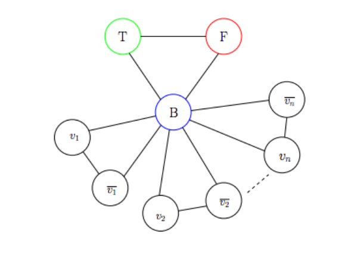

### Exact Cover
>Dado un conjunto $X$ y una colección S de subconjuntos de $X$, el problema consiste en determinar si existe un subcolector $S' \subseteq S$ tal que cada elemento de $X$ aparezca exactamente una vez en los subconjuntos de $S'$.

Primero demostremos que es NP. Supongamos que tenemos una solución candidata $S' \subseteq S$. Queremos verificar si esta solución cumple con las condiciones del problema en tiempo polinomial. Si la suma de las cardinalidades de los subconjuntos es mayor que $|X|$ entonces no es solución del problema puesto que habría al menos un elemento que se repite en los subconjuntos, y si la cardinalidad de los subconjuntos fuera menor que $|X|$ entonces hay al menos un elemento de $X$ que no está en ningún subconjunto, esta comprobación se logra en $O(|W|)$ (que es polinomial) donde $W = \sum_{S_i \in S'} |S_i|$. Ahora quedaría verificar que cada elemento aparece exactamente una vez. Para esto recorremos $X$ verificando que cada elemento aparece en algún subconjunto de $S$, esto se logra en $O(|U| \cdot |X|)$ (que también es polinomial) donde $U = \bigcup_{S_i \in S'} S_i$.

Para demostrar que **Exact Cover** es NP-Completo vamos a reducir **SAT** a este
> SAT $\leq_p$ Exact Cover

Dado un conjunto $F=\set{C_1,\dots,C_l}$ de $l$ cláusulas construidas a partir de $n$ variables booleanas tenemos que contruir una instancia $\tau(F)=(X,S)$ de **Exact Cover** tal que $F$ es satisfacible ssi $\tau(F)$ tiene solución.

El método para construir $(X,S)$ es de la siguiente forma. Sea

$$
C_j=(L_{j1} \lor \dots \lor L_{jm_j})
$$

la j-ésima cláusula en $F$, donde $L_{jk}$ denota  el k-ésimo literal en $C_j$ y $m_j \geq 1$. El universo de $\tau(F)$ es el conjunto:

$$
X = \set{x_i | 1 \leq i \leq n} \bigcup \set{C_j|1\leq j \leq l} \bigcup \set{p_{jk} | 1 \leq j \leq l, 1 \leq k \leq m_j}
$$

donde el 3er conjunto $p_{jk}$ corresponde al k-ésimo literal en $C_j$.

Los siguientes subconjuntos están incluidos en S:

1. Hay un conjunto $\set{p_{jk}}$ por cada $p_{jk}$.
2. Por cada variable booleana $x_i$ los siguientes 2 conjuntos están incluidos en $S$:

$$
T_{i,T} = \set{x_i} \bigcup \set {p_{jk} | L_{jk} =  \overline{x_i}} 
$$

que contiene a $x_i$ y todas las ocurrencias negativas de $x_i$, y

$$
T_{i,F} = \set{x_i} \bigcup \set {p_{jk} | L_{jk} =  x_i} 
$$

que contiene a $x_i$ y todas las ocurrencias positivas de $x_i$.

Nótese que en $T_{i,T}$ están las ocurrencias negativas y en $T_{i,F}$ están las positvas de $x_i$

3. Por cada cláusula de $C_j$, los $m_j$ conjuntos  $\set{C_j, p_{jk}}$ están en $S$.

Nos queda demostrar que $F$ es satisfacible ssi $\tau(F)$ tiene solución.

Sea $v$ una asignación que satisface $F$, entonces podemos hacer un cubrimiento exacto $S'$ de la siguiente forma:

Por cada $x_i$ agragamos el subconjunto $T_{i,T}$ a $S'$ ssi $v(x_i) = T$, de lo contrario agregamos $T_{i,F}$ a $S'$ ssi $v(x_i) = F$.

También, por cada cláusula $C_j$ agragamos un subconjunto $\set{C_j, p_{jk}}$ a $S'$ según algún literal $L_{jk}$ que se hizo verdadero por la asignación $v$. Los literales representados por los $p_{jk}$ siempre van a existir puesto que por hipótesis tenemos una asignación satisfacible, por lo tanto en cada cláusula debe haber al menos un literal con valor de verdad 1.

Como, en otras palabras, lo que hacen los subconjuntos $T_{i,T}$ y $T_{i,F}$ es cubrir aquellos literales cuyo valor de verdad es 0 y los subconjuntos de la forma $\set{C_j, p_{jk}}$ lo que hacen es cubrir un literal de cada cláusula cuyo valor de verdad es 1 pueden faltar aún algunos $p_{jk}$ cuyo valor de verdad es 1 por agregar. Por tanto una vez que ya cubrimos todos los $x_i$ y todos los $C_j$ añadimos a $S'$ los conjuntos $\set{p_{jk}}$ según los $p_{jk}$ que nos falten por cubrir.

Por otro lado si $S$ es un cubrimiento exacto de $\tau(F)$ definimos una asignación que satisface $F$ de la siguiente forma.

Por cada $x_i$, si $T_{i,T}$ está en $S'$ establecemos $v(x_i) = T$, de lo contrario si $T_{i,F}$ esté en $S'$ establecemos $v(x_i) = F$.

---

### Clique

>Un clique es un subgrafo completo dentro de un grafo. Formalmente, un clique en un grafo $G=(V,E)$ es un subconjunto de vértices $C \subseteq V$, tal que todos los pares de vértices en $C$ están conectados directamente por una arista. En otras palabras, todos los vértices del clique están mutuamente conectados.
>
>Hallar el clique de mayor tamaño en un grafo.

Vamos a demostrar que Clique (maximal) es un problema NP-Hard. Para esto vamos a coger el problema SAT que sabemos que es NP-Completo y reducirlo a  Clique (maximal).

> SAT $\leq_p$ Clique (maximal)

Dado un conjunto $F=\set{C_1,\dots,C_l}$ de $l$ cláusulas construidas a partir de $n$ variables booleanas tenemos que contruir una instancia $\tau(F)=(G)$ de **Clique (maximal)** tal que podemos determinar si $F$ es satisfacible ssi podemos hallar el clique maximal de $\tau(F)$.

El método para construir $G=(V,E)$ es de la siguiente forma. Sea:

$$
C_j=(L_{j1} \lor \dots \lor L_{jm_j})
$$

la j-ésima cláusula en $F$, donde $L_{jk}$ denota  el k-ésimo literal en $C_j$ y $m_j \geq 1$. Los vértices de $G$ tendrán la siguiente forma:

$$
V=\set{\langle L_{ji}, j\rangle | L_{ji} \in C_j, 1 \leq j \leq l, 1 \leq i \leq m_j }
$$

Estos vértices estarán conectados por aristas de manera que los vértices pertenecientes a la misma cláusula no estarán conectados y ninguna variable booleana estará conectada con su complemento. De manera más formal:

$$
     E = \{ (u, v) | u, v \in V, u = (L_{ji}, j), v = (L_{k\ell}, k), j \neq k, L_{ji}  \text{ y } L_{k\ell}  \text{ no son complementarios}\}
$$

Sea $M$ una caja negra capaz de resolver **Clique maximal** en tiempo polinomial.

Si $F$ fuera satisfacible habría al menos un literal en cada cláusula que tomaría valor de verdad 1. Si tomamos un literal de estos de cada cláusula, por cosntrucción de $E$, podemos apreciar que estos forman un clique de tamaño $l$ en $G$ (porque son $l$ cláusulas), puesto que si algún par de los literales que escogimos fueran complementarios ambos no tendrían valor de verdad 1. Ninguno de los cliques formados por esta vía puede tener un tamaño mayor que $l$ ya que un vértice puede estar conectado con literales de a lo sumo $l-1$ cláusulas distintas y además los literales que pertenecen a la misma cláusula no están conectados entre sí. Por tanto ese clique es maximal.

Si $F$ no fuera satisfacible entonces para cualquier dispoción de los valores de verdad de las variables boolenas siempre habría al menos una cláusula que nunca tomaría valor de verdad 1. Entonces por construcción de $G$ el clique de mayor tamaño no tendría $l$ vértices.

Luego para resolver SAT nos bastaría con hacer un llamado a $M$ con el grafo $G$ y luego contar la cantidad de vértices que tiene el clique $C$ que nos devolvió $M$ (este chequeo se hace en tiempo polinomial), si $|V(C)|=l$ entonces $F$ es satisfacible, si $|V(C)| \neq l$ entonces $F$ no es satisfacible.

---
### Cobertura de Clique

>Dado un grafo $G=(V,E)$, una cobertura de cliques es un conjunto de cliques $\{C_1,C_2,…,C_k\}$ tal que cada arista $(u,v) \in E$ pertenece a al menos uno de estos cliques.

>El objetivo del problema de cobertura de cliques es encontrar el número mínimo de cliques necesarios para cubrir todas las aristas del grafo.

---
### Número Cromático

>El número cromático de un grafo es el número mínimo de colores necesarios para colorear los vértices del grafo de manera que dos vértices adyacentes no compartan el mismo color.

>Hallar el número cromático en un grafo.

Primero vamos a reducir **3-SAT** a **3-Coloreable** para demostrar que este último es NP-Hard.

> **3-SAT** $\leq_p$ **3-Coloreable** 

Dado un conjunto $S=\set{C_1,\dots,C_l}$ de $l$ cláusulas construidas a partir de $n$ variables booleanas tenemos que contruir una instancia $\tau(S)= G$ de **3-Coloreable** tal que $S$ es satisfacible ssi $\tau(S)$ es 3-coloreable. 

Para construir el grafo $G=(V,E)$ vamos a definir los vértices $v_i$ y $\overline{v_i}$ por cada variable $x_i$ del problema **3-SAT**. Además vamos a definir los vértices $\set{T, F, B}$ los cuáles formaran un triángulo en $G$ y cada uno tendrá asignado un color distinto, $T$ el color True, $F$ el color False y $B$ el color Base. También vamos a conectar mediante aristas los vértices $v_i$, $\overline{v_i}$ y $B$ para cada $x_i$ formando así un triángulo por cada $x_i$. Nuestro grafo $G$ hasta ahora tiene esta forma:

Como se puede apreciar para cualquier 3-coloreo de este grafo los $v_i$

